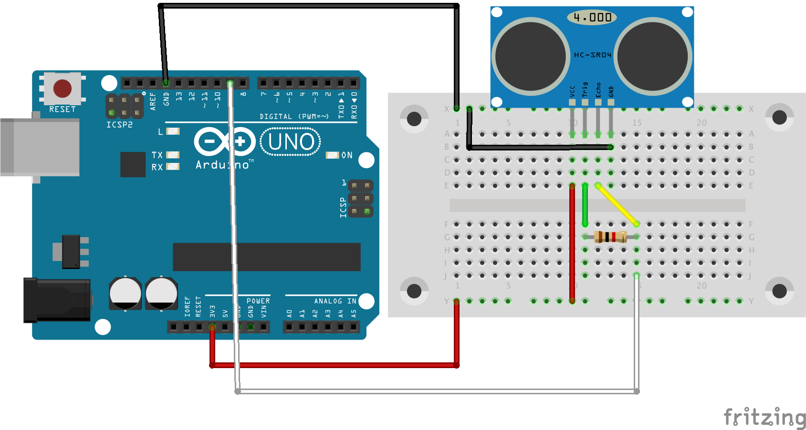

# simblee develop

スペルミスしているのはまあ許して 😇
(I'm sorry for my typing mistakes 😇)

このレポジトリはsimbleeで，測距センサーHC-SR04を使用するためのレポジトリになります．使用が可能になったところで，このレポジトリをそれっぽい名前に変更しておきます．
(This repo is enable to use distance sensor "HC-SR04". If it can use it, this repo to rename for that.)

## 結線図 (Circle example)

### 注意点

HC-SR04のTrugピンとEchoピンを1k$\Omega$の抵抗でショートさせている．これで1ピンで操作が可能なので，VCCとGND，信号線が一つしかないsimbleeで測距が可能になる．simbleeの時にはプルアップとして10k$\Omega$くらいの抵抗を入れておく必要がある．
